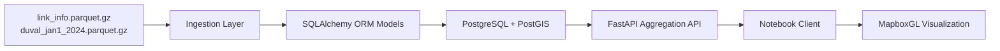

# Architecture Diagram

Primary asset:

Fallback editable text version:

```mermaid
flowchart LR
    A["link_info.parquet.gz<br/>duval_jan1_2024.parquet.gz"] --> B["Ingestion Layer"]
    B --> C["SQLAlchemy ORM Models"]
    C --> D["PostgreSQL + PostGIS"]
    D --> E["FastAPI Aggregation API"]
    E --> F["Notebook Client"]
    F --> G["MapboxGL Visualization"]
```
